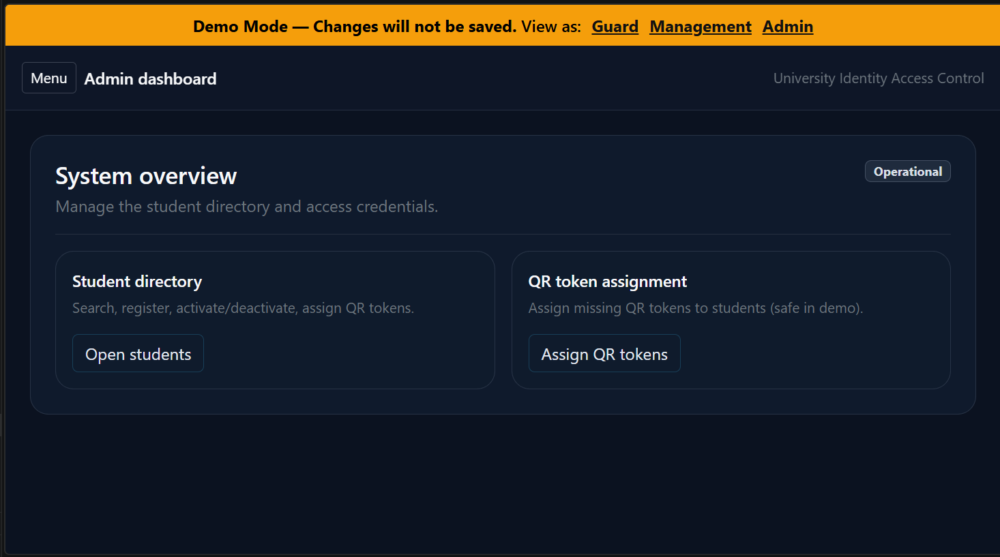
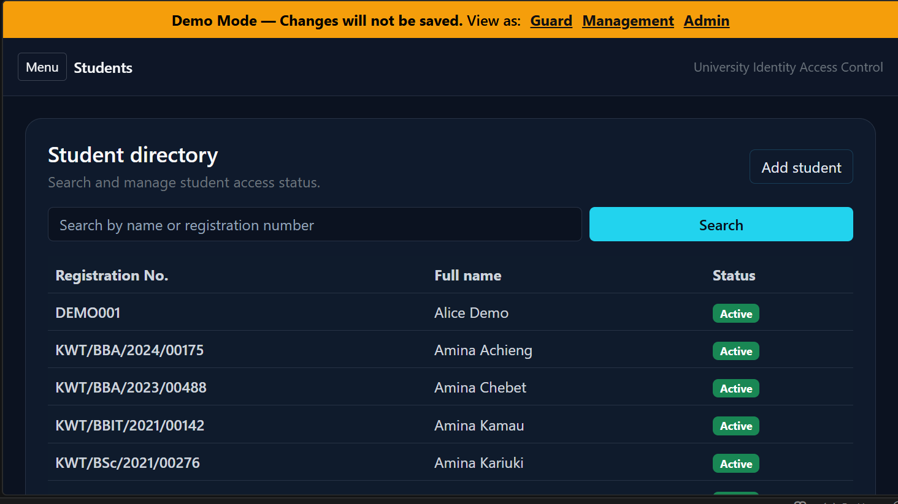
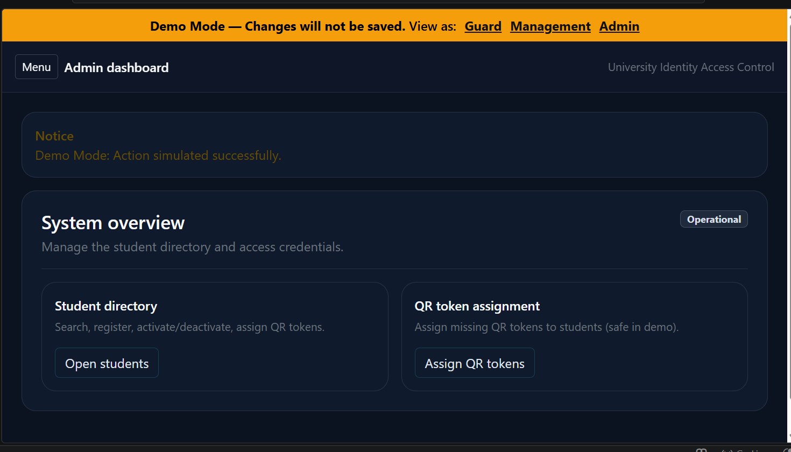
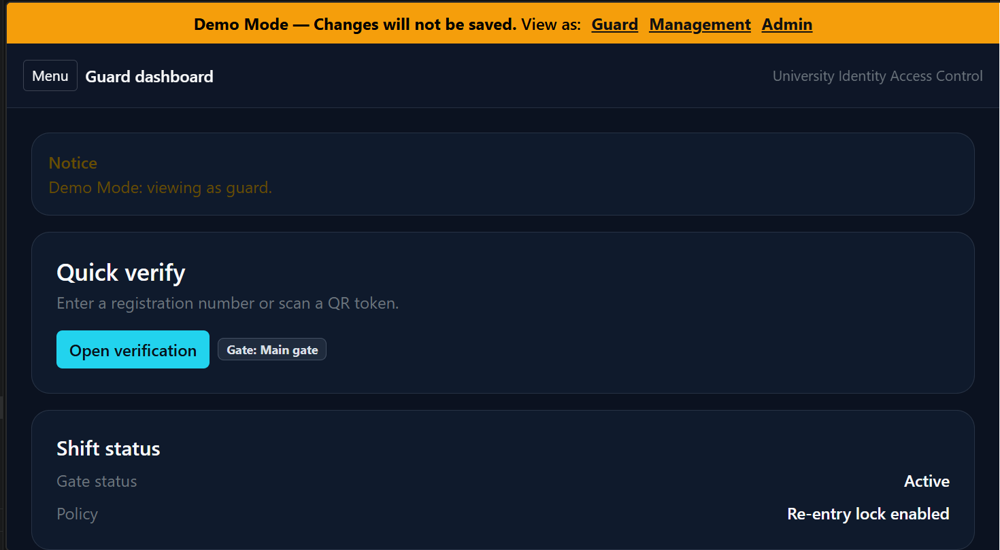

# Kwetu Identity Control™ — Identity & Access Management System

Kwetu Identity Control™ is a structured identity and access management platform designed to support secure institutional access workflows, QR-based identity verification, and operational user control.

Built for institutions, campuses, organizations, and controlled operational environments requiring centralized identity visibility and credential management.

---

## 🚀 Overview

Kwetu Identity Control™ provides a structured framework for managing digital identities, access credentials, and QR-based verification workflows.

The platform enables administrators and operational teams to:

- Register and manage identities
- Assign QR access tokens
- Control user activation/deactivation
- Support operational guard verification
- Improve institutional access accountability
- Centralize identity administration workflows

This demo version is configured for safe public showcasing with demo-mode protections enabled.

---

## 🧠 Core Features

- Identity Registration & Management
- QR Token Assignment
- Role-Based Operational Views
- Guard Verification Workflow
- Access Status Management
- Administrative Dashboard
- QR Identity Validation
- Mobile-Friendly Interface
- Demo Protection Mode
- Structured Access Control Workflow

---

## 📸 System Screenshots

### Admin Dashboard



---

### Student Directory



---

### QR Token Assignment



---

### Guard Verification View



---

## 🛠️ Tech Stack

### Backend

- Python
- Flask

### Frontend

- HTML
- CSS
- JavaScript

### Database

- SQLite

---

## ⚙️ Installation

### 1. Clone Repository

```bash
git clone https://github.com/kwetu-stack/identity-Control-System.git
cd identity-Control-System
2. Create Virtual Environment
Windows
python -m venv .venv
.venv\Scripts\activate
Mac/Linux
source .venv/bin/activate
3. Install Requirements
pip install -r requirements.txt
4. Configure Environment

Copy:

.env.example

to:

.env

Then update environment values if needed.

5. Run Application
python app.py
6. Access System
http://127.0.0.1:5000
💼 Operational Use Cases

Kwetu Identity Control™ is suitable for:

Universities & Colleges
Schools & Institutions
Corporate Access Control
Residential Facilities
Security Operations
Visitor Verification Systems
Campus Identity Management
QR Credential Operations
🔒 Demo Mode

This public demo version is configured with safe demo protections.

Changes made through the live demo interface are not permanently saved.

📈 Roadmap
v1.1
Real QR Scan Integration
Identity Photo Support
Visitor Access Tokens
v2.0
Multi-Institution Support
Real-Time Access Logs
SMS/Email Verification
v2.1
Full SaaS Deployment
Advanced Role Permissions
Cloud-Based Identity Analytics
👤 Author

Bundi Murithi
Founder & Software Engineer
Kwetu Partners Ltd

🌍 About Kwetu Partners

Kwetu Partners builds operational business systems focused on:

Inventory Management
Logistics & Dispatch
Visitor & Reception Management
Construction Management
Education Technology
Identity & Access Systems

Kwetu follows a Monozukuri-inspired engineering philosophy centered on craftsmanship, operational clarity, and long-term system reliability.

Website:

https://kwetupartners.net/

📄 License

MIT License — Free to use, modify, and distribute.

🌐 Built in Kenya

Designed and engineered by Kwetu Partners Ltd.

Focused on solving practical operational challenges across emerging markets.